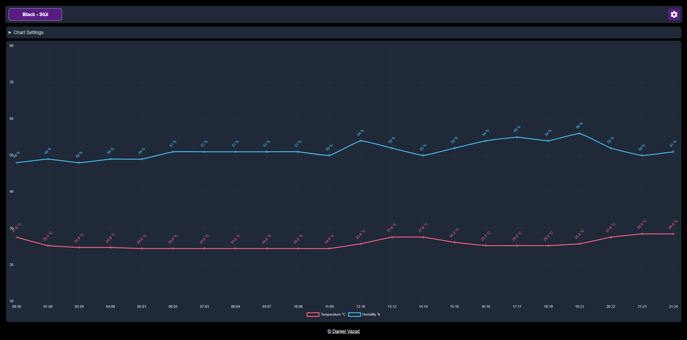
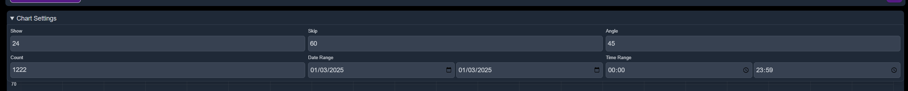
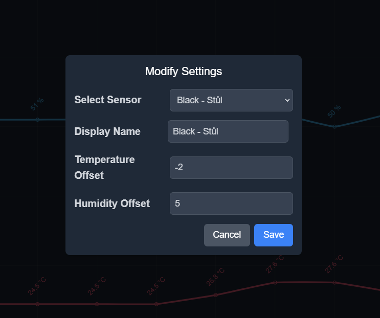
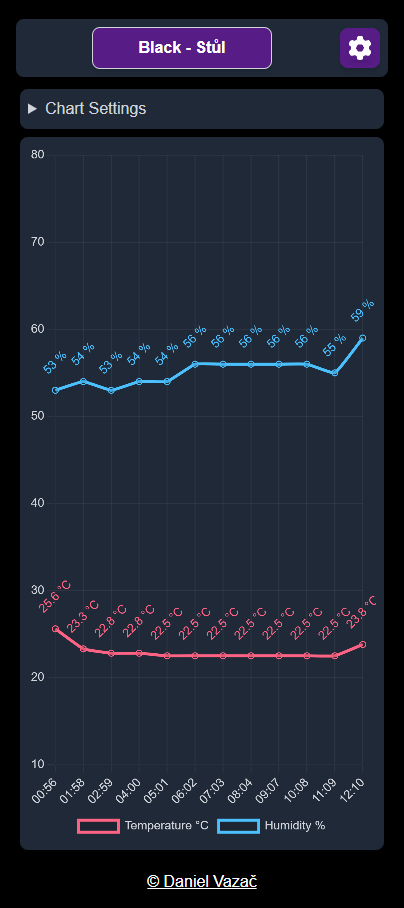

# ClimateTracker

## Before you start

This project is a simple app for ESP to monitor humidity and temperature in the room. It is an HTML server with JavaScript, data is stored in MongoDB and can be downloaded. The website is responsive and can be used on mobile devices.

## Description

ClimateTracker allows you to monitor humidity and temperature using an ESP device. The data is displayed on a responsive web interface and can be downloaded for further analysis.

## Features

- Real-time monitoring of temperature and humidity
- Responsive web interface
- Data storage and download capability
- Customizable settings for data display
- Support for multiple sensor types

## Technologies Used

- **PlatformIO**: An open-source ecosystem for IoT development.
- **ESP32**: A low-cost, low-power system on a chip microcontroller.
- **Vue.js**: A progressive JavaScript framework for building user interfaces.
- **Nuxt.js**: A framework for creating Vue.js applications with server-side rendering.
- **Chart.js**: A JavaScript library for creating charts.
- **Vue Chart.js**: A wrapper for Chart.js in Vue.
- **Tailwind CSS**: A utility-first CSS framework.
- **Axios**: A promise-based HTTP client for the browser and Node.js.
- **TypeScript**: A typed superset of JavaScript that compiles to plain JavaScript.
- **MongoDB**: A NoSQL database for storing sensor data.

## How to use

### Requirements

- ESP
- Humidity and temperature sensor (DHT11, DHT22, AM2302, AM2321, AM2320, RHT03, Si7021, HTU21D, SHT21)

### Setup

1. Clone this repository
2. Install [PlatformIO](https://platformio.org/)
3. Connect your ESP32 to your computer
4. Open this project in PlatformIO
5. Change `ssid` and `password` in `src/main.cpp` to your WiFi credentials
6. Change `sensorType` in `src/main.cpp` to your sensor type
7. Upload the project to ESP32
8. Upload the File System image to ESP32
9. Reserve an IP address for ESP32 in your router
10. Set up local DNS to redirect `esp.local` to the IP address of ESP32
11. Run `docker-compose up -d` to start MongoDB, Express, and Nuxt
12. Open `esp.local` in your browser
13. Enjoy

## Images

## License

This project is licensed under the MIT License. See the [LICENSE](LICENSE.txt) file for details.